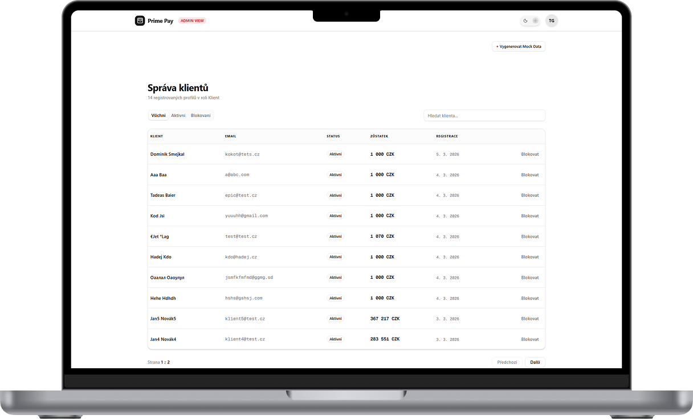
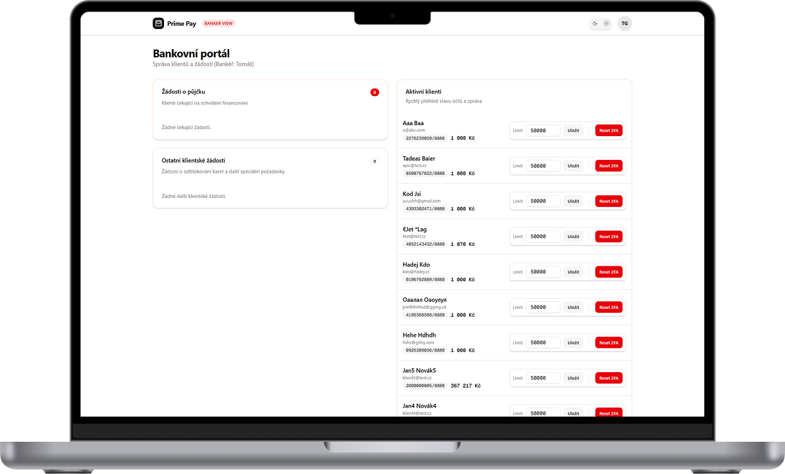
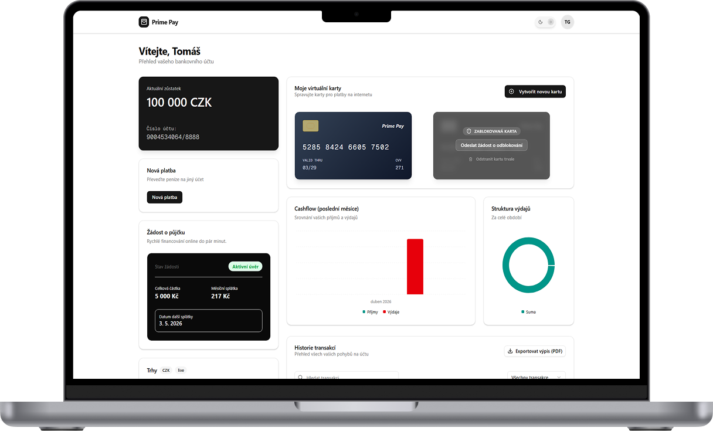
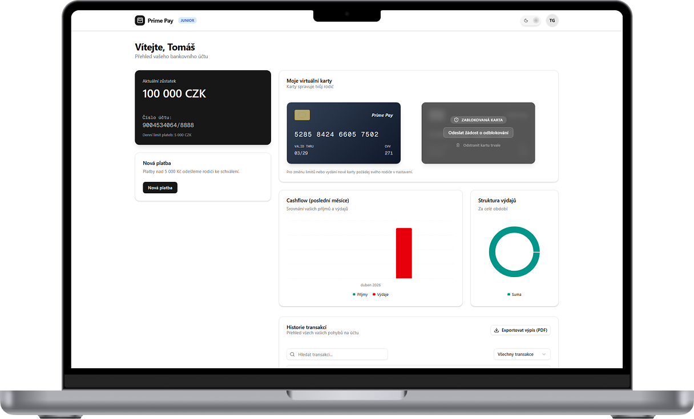

# PrimePay

> Bankovní platforma pro hackathon UTB 2026 — **2. místo** 🥈

**[→ Live demo](https://hackathon-kohl-mu.vercel.app/)**

---

## O projektu

PrimePay je bankovní platforma postavená na Next.js a Supabase. Projekt vznikl během 48hodinového hackathonu na Univerzitě Tomáše Bati ve Zlíně, kde se umístil na **2. místě**.

Platforma pokrývá kompletní bankovní workflow — od správy účtů přes platby, půjčky, až po rodinné podúčty s rodičovským schválením transakcí.

---

## Funkce

- **Virtuální karty** — vydávání karet s denními limity a sledování výdajů
- **Okamžité platby** — převody s adresářem příjemců
- **Rodinné podúčty** — dětské účty s limity a schvalováním transakcí rodičem
- **Půjčky & úvěry** — žádost o půjčku, schválení bankeřem, sledování splátek
- **Live kurzy měn** — real-time směnné kurzy EUR, USD, GBP, CHF
- **Přehled výdajů** — týdenní grafy a analytika
- **Live Activity Feed** — notifikace o každé události v reálném čase
- **Automatické odhlášení** — bezpečnostní session management
- **2FA autentizace** — dvoufaktorové přihlášení
- **Row Level Security** — Supabase RLS na úrovni databáze

---

## Role

Platforma rozlišuje 4 specializované role s odlišnými pravomocemi:

### Administrator
Plná kontrola nad infrastrukturou — správa uživatelů, audit logy, globální konfigurace.



### Banker
Správa klientů — schvalování půjček, odblokování karet, přehled portfolií.



### Client
Plnohodnotný bankovní dashboard — virtuální karty, platby, live kurzy, rodinné účty.



### Child
Bezpečné prostředí s denními limity — platby nad limit vyžadují schválení rodiče.



---

## Tech stack

| Vrstva | Technologie |
|---|---|
| Framework | Next.js 16 (App Router, Turbopack) |
| Databáze | Supabase (PostgreSQL + RLS) |
| Auth | Supabase Auth |
| Styling | Tailwind CSS |
| Animace | Framer Motion |
| UI komponenty | shadcn/ui |
| Deployment | Vercel |

---

## Autoři

Projekt vytvořili:

- **Ondřej Topínka** — [github.com/Topeez](https://github.com/Topeez)
- **Tomáš Greguš** — [github.com/gregustomas](https://github.com/gregustomas)

---

## Spuštění lokálně

```bash
git clone https://github.com/gregustomas/hackathon.git
cd hackathon/prime-pay
npm install
```

Vytvoř `.env.local` se Supabase credentials:

```env
NEXT_PUBLIC_SUPABASE_URL=your_supabase_url
NEXT_PUBLIC_SUPABASE_ANON_KEY=your_supabase_anon_key
```

```bash
npm run dev
```

Otevři [http://localhost:3000](http://localhost:3000).
